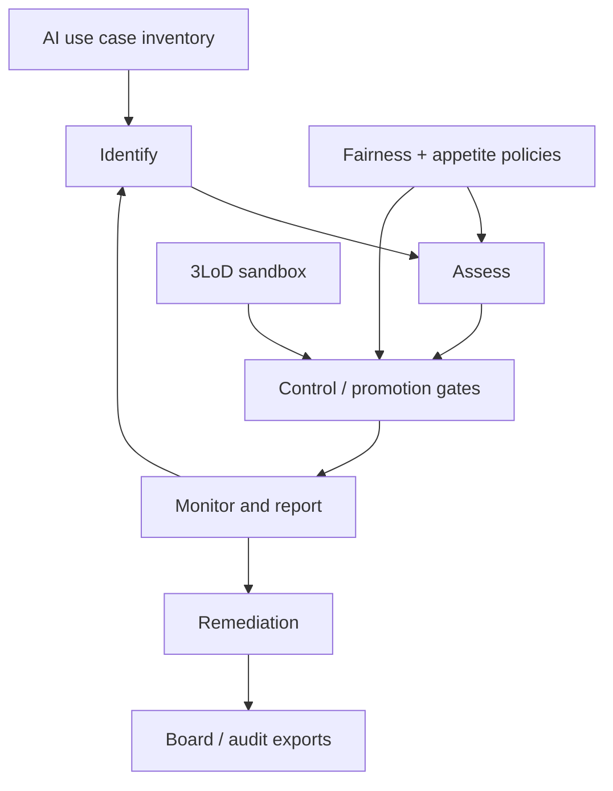

# Guardloop

**Source:** `ai-in-decentralized+ai/deloitte-gx-ai-and-risk-management/`
**Domain:** `ai-decentralized`
**One-liner:** A continuous Identify–Assess–Control–Monitor desk for AI model risk in financial services that binds fairness policy and risk appetite to live pricing (and similar) models so firms can innovate without losing auditability.
**Wedge:** EU/UK insurers and banks deploying AI policy pricing or credit decisioning who already have an enterprise RMF but cannot run it at AI learning speed — starting with one insurance pricing model as in Deloitte’s worked example.
**Positioning:** AI risk-management operations, not a generic model registry. Deloitte GX argues effective RMF is pivotal to AI adoption; the hard problem is existing risks becoming harder to spot or manifesting unfamiliarly as models learn continuously; boards need fairness policy and refreshed appetite inside a faster identify-assess-control-monitor loop. Guardloop productises that loop for FS AI — distinct from Pilotspan (pilot portfolio readiness) and Agentfence (agent kill-switches).

## Market research synthesis

### Thesis from source

Deloitte’s *AI and risk management: Innovating with confidence* targets financial services firms that see AI’s efficiency and customer-engagement upside but are blocked by data quality, culture, regulation, and fear after years of conduct penalties. A Deloitte/EFMA survey of 3,000+ C-suite executives found AI adoption still early (40% still learning; 11% not started; only 32% actively developing), with impact expectations differing by sector (e.g. banking customer service 65%; insurance back office 78%). Barriers include legacy data silos, opacity of deep learning “black boxes,” GDPR-style explainability duties for automated decisions, scarce talent, and human-capital side effects of automation.

The paper’s distinctive claim: firms do not need wholly new risk types so much as faster, ai-aware versions of Identify → Assess → Control → Monitor/Report, plus risk-appetite updates including fairness policy, sandbox participation by all three lines of defence, and continuous reassessment as models learn. The worked example — model risk in an AI property insurance pricing solution — shows how unstructured local features can encode one-off events as permanent risk, creating bias and non-causal inference hazards; controls must span algorithm validity and fairness of outcomes; monitoring must catch drift at short intervals before large-scale errors land. Regulators are framed as benefit-aware but consequence-minded; firms must evidence understanding, not merely deploy.

### Buyer & economic model

- **Primary buyer:** Chief Risk Officer or Head of Model Risk Management at an insurer/bank with AI in customer-impacting decisions.
- **Users:** model validators, pricing actuaries/data scientists, conduct/compliance, internal audit, business owners, board risk committee delegates.
- **Budget owner / value metric:** residual model-risk within appetite; time-to-detect unfair or drifted pricing; audit findings closed without regulatory action.
- **Competing status quo:** annual model validation cycles, static appetite statements, and slide-deck “AI ethics principles” disconnected from live pricing controls.

### Domain constraints

- **Regulatory / trust / safety:** conduct risk, algorithmic bias, explainability for automated decisions, PRA/FCA/EU AI expectations; customer mistreatment history drives conservatism.
- **Data sensitivity:** pricing and underwriting features may be personal or proxy-sensitive; monitoring outputs must support challenge without indiscriminate PII export.
- **Change-management realities:** first and second lines must share a sandbox mindset; Guardloop must attach to existing model inventories rather than replace core pricing engines.

## Business requirements

- BR-1: Every in-scope AI use case must run a continuous Identify–Assess–Control–Monitor cycle with intervals shorter than traditional annual validation when the model learns continuously.
- BR-2: A fairness policy must be versioned and binding on Assess/Control stages before a customer-impacting model may promote.
- BR-3: Risk appetite statements must include ai-specific components (e.g. bias tolerance, explainability coverage) reviewable when use cases expand from internal advice to customer-facing.
- BR-4: Identification must capture both use-case risks and organisation-wide AI adoption risks (culture, staffing, manual fallback capacity).
- BR-5: Assessment must cover technical metrics (bias, classification error) and customer/conduct outcomes, not accuracy alone.
- BR-6: Controls must test outcome fairness on held-out cohorts and block promotion when thresholds breach appetite.
- BR-7: Monitoring must alert when unstructured or non-causal features begin dominating pricing drivers (per insurance example).
- BR-8: Material SLA breaches or fairness breaches must open remediation programmes with owners and board-reportable status.
- BR-9: Three lines of defence must have role-appropriate access to sandbox evidence and residual risk views.
- BR-10: Explainability artefacts sufficient for GDPR-style customer explanations must be producible for automated significant decisions.
- BR-11: Expansion of a PoC to external customers must force a fresh Identify pass before go-live.
- BR-12: Audit exports must demonstrate what was known when about model behaviour, controls, and appetite — suitable for regulators.

## User stories

Canonical user stories live in sibling [USER_STORIES.md](USER_STORIES.md).

## System design

### Overview

Guardloop inventories AI use cases, binds each to fairness policy and appetite limits, and runs the four-stage RMF loop with evidence artefacts. For insurance pricing (beachhead), feature-driver monitoring, cohort fairness tests, and promotion gates sit on the control path; drift and conduct alerts sit on the monitor path; remediation cases feed board reporting. Sandbox workspaces let lines of defence challenge before production.

### Actors & boundaries

- **Actors:** model owners, validators, compliance, audit, board delegates, platform operator; customers receive explanations via firm channels.
- **Trust boundary:** Guardloop holds risk artefacts, policies, and monitoring summaries; production pricing engines remain systems of record for quotes.
- **Human-in-the-loop points:** promotion approval, appetite changes, remediation ownership, PoC-to-production expand reviews.

### Core capabilities

1. **Use-case inventory** — register AI solutions and customer-impact scope.
2. **Fairness and appetite policy** — versioned binding rules.
3. **Identify workspace** — continuous and event-driven risk identification.
4. **Assess workspace** — technical + conduct assessment.
5. **Control and promotion gates** — tests, blocks, sandbox evidence.
6. **Monitor and alert** — drift, bias, driver-shift telemetry.
7. **Remediation programmes** — owned actions and board status.
8. **Explainability and audit export** — customer and regulator packs.

### Conceptual data

- **Primary entities:** AiUseCase, FairnessPolicy, RiskAppetiteLimit, RiskIdentification, RiskAssessment, ControlTest, PromotionGate, MonitorAlert, RemediationCase, ExplanationPack.
- **Critical events:** use case registered, policy bound, risk identified, assessment completed, promote blocked/allowed, alert raised, remediation closed.
- **Retention / audit needs:** full RMF evidence retained for regulatory lookback; monitoring samples minimised of raw PII.

### Integrations (conceptual)

- **Systems of record:** model inventory, pricing/quote engines, policy admin, GRC tools.
- **Upstream signals:** training/serving metrics, feature stores, complaint/conduct feeds, BEAT-like voice analytics (optional).
- **Downstream actions:** promote/rollback hooks, board risk reports, customer explanation requests.

### High-level architecture

### Success metrics

- **Leading:** median time from drift alert to control action; % promotions with fairness tests passed; sandbox challenge participation by second/third line.
- **Lagging:** conduct incidents tied to AI pricing; regulatory findings on model governance; residual risk within appetite; time from PoC expand request to completed re-identify.

## OpenAPI skeleton

Canonical HTTP surface lives in sibling [openapi.yaml](openapi.yaml). Summary:

- **Base path:** `/v1/...`
- **Auth:** `X-API-Key` for monitoring integrations; Bearer JWT for risk operators.
- **Resource groups:** UseCases, Policies, Assessments, Controls, Monitoring, Remediations.
