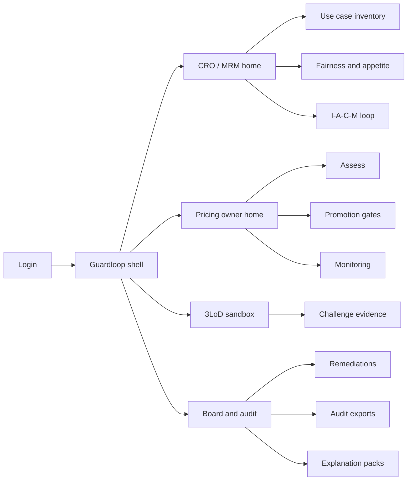
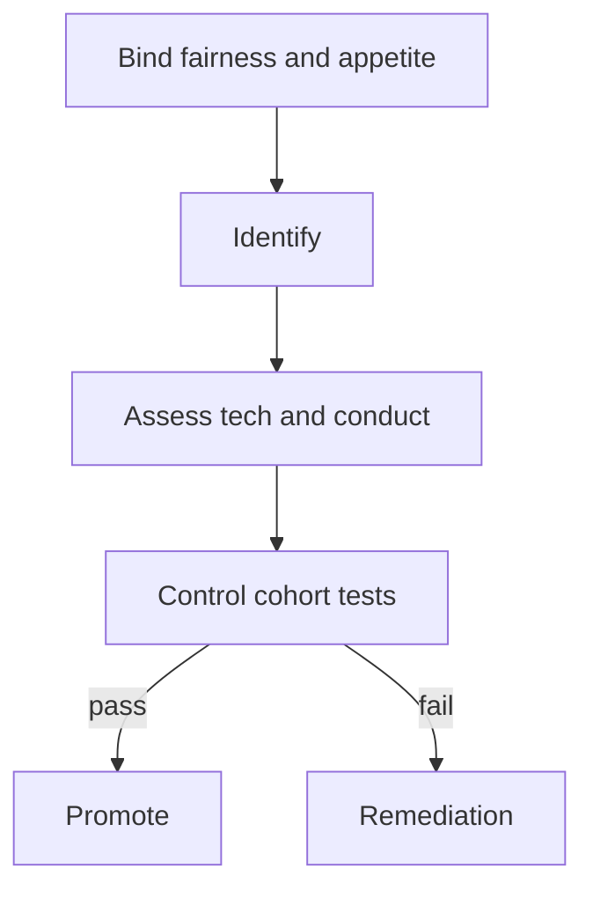

# Guardloop — Web app

**Product:** [PRODUCT.md](./PRODUCT.md)
**Primary surface:** Continuous AI model-risk desk for financial services (MRM + pricing owner under one Guardloop shell)
**Secondary surfaces:** 3LoD sandbox challenge workspace; board/regulator evidence export viewer
**Design thesis:** Guardloop is a four-beat risk metronome for learning models — not a generic GRC checklist or ML experiment tracker. The UI metaphor is Identify → Assess → Control → Monitor as a living loop around each customer-impacting use case: fairness policy and appetite are binding dials, not slide principles; promotion is a gate with cohort evidence; monitoring catches non-causal driver shift before conduct scale. Visual language is cool FS slate with appetite-teal inside limits and conduct-coral when fairness or drift breaches. The brand wordmark sits as a quiet assurance mark on every promote and board-export screen so CROs know whose RMF loop they are trusting.

## UX research synthesis

### Category peers (best-in-class)

- **SAS Model Risk Management / Moody’s RiskFoundation:** Model inventory, validation workflows, regulatory evidence. Steal: use-case inventory tied to validation artefacts; reject annual-only cycles as the default cadence for continuously learning models.
- **Fiddler / Arthur / WhyLabs monitoring:** Drift, fairness, explainability for production ML. Steal: short-interval driver-shift and cohort fairness alerts; reject pure data-science dashboards that omit conduct outcomes and board remediation.
- **ServiceNow GRC / MetricStream:** Remediation ownership, three lines of defence, board reporting. Steal: owned remediation with board-reportable status; reject generic IT risk taxonomies that ignore AI fairness policy versions.
- **Google What-If / Fairlearn studio patterns:** Cohort fairness tests before promote. Steal: held-out cohort controls as promotion blockers; reject lab-only notebooks disconnected from appetite.

### Patterns to adopt / reject

- **Adopt:** Continuous I–A–C–M loop per use case; versioned fairness policy bound before promote; appetite with ai-specific components; technical + conduct assessment; non-causal driver alerts (insurance example); PoC→customer re-identify gate; 3LoD sandbox visibility; explainability packs; audit “what was known when.”
- **Reject:** Annual validation as sole defence; ethics PDF as control; accuracy-only gates; purple “responsible AI” glow; replacing the pricing engine UI; PII-heavy monitoring exports.

### Trust, density, and workflow constraints from PRODUCT.md

Learning models need loops faster than annual validation (BR-1). Fairness policy is versioned and binding (BR-2). Appetite includes bias/explainability components (BR-3). Identify covers use-case and org-wide risks (BR-4). Assess spans technical + conduct (BR-5). Controls block promote on fairness breach (BR-6). Monitoring catches unstructured/non-causal driver dominance (BR-7). Breaches open owned remediations (BR-8). 3LoD role-appropriate access (BR-9). Explainability for significant automated decisions (BR-10). External expansion forces re-identify (BR-11). Audit exports for regulators (BR-12).

## Information architecture

### Nav model

### Roles → default home

| Role | Default home | Why |
|------|--------------|-----|
| CRO / model risk manager | MRM home — residual risk vs appetite | Continuous loop oversight (BR-1, BR-3) |
| Pricing / DS owner | Promotion gates + monitoring | Release with residual risk visible (BR-6, BR-7) |
| Conduct / compliance | Fairness policies + explanations | Binding policy + GDPR-style packs (BR-2, BR-10) |
| Internal audit / board delegate | Remediations + audit exports | Evidence-based oversight (BR-8, BR-12) |
| Validator (2LOD) | 3LoD sandbox | Challenge before production (BR-9) |

### Cross-links to OpenAPI resources

| Nav area | OpenAPI tags / resources |
|----------|---------------------------|
| AI use case inventory | UseCases |
| Fairness and appetite | Policies |
| Identify and assess | Assessments |
| Promotion gates and tests | Controls |
| Drift / fairness alerts | Monitoring |
| Owned programmes | Remediations |

## Screen inventory

### MRM home

- **Purpose:** Answer “which learning models are inside appetite this week?” in one composition.
- **Entry:** CRO/MRM login default.
- **Layout regions:** Brand + book selector; residual risk vs appetite strip; open loop stages by use case; breach/remediation alerts; org-wide AI risk chips (culture, fallback staffing).
- **Primary actions:** Open use case loop; review remediation; export board pack.
- **Empty / loading / error:** Empty = register first in-scope AI use case; error = monitoring feed down.
- **BR / story ties:** BR-1, BR-3, BR-4.

### Use case inventory

- **Purpose:** Register AI solutions with customer-impact scope and learning cadence.
- **Entry:** MRM nav.
- **Layout regions:** Inventory table; internal vs customer-facing flag; continuous-learning interval; bound policy versions; expand-to-customer CTA.
- **Primary actions:** Register; bind fairness/appetite; trigger re-identify on expand.
- **Empty / loading / error:** Expand blocked until Identify refreshed (BR-11).
- **BR / story ties:** BR-1, BR-11.

### Fairness and appetite policies

- **Purpose:** Version binding fairness rules and ai-specific appetite before promote.
- **Entry:** Policies nav; promote prerequisite.
- **Layout regions:** Fairness policy editor; appetite components (bias tolerance, explainability coverage); version history; model binding matrix.
- **Primary actions:** Publish version; bind to use case; compare to prior.
- **Empty / loading / error:** Unbound policy = promote disabled.
- **BR / story ties:** BR-2, BR-3.

### Identify workspace

- **Purpose:** Continuous and event-driven risk identification for use-case and org-wide AI risks.
- **Entry:** Loop → Identify; expand event.
- **Layout regions:** Risk register; triggers (new features, PoC expand, staffing change); carnival/non-causal hazard prompts for pricing; fallback capacity notes.
- **Primary actions:** Log risk; assign owner; push to Assess.
- **Empty / loading / error:** Stale Identify beyond interval = amber.
- **BR / story ties:** BR-4, BR-11; insurance example.

### Assess workspace

- **Purpose:** Technical metrics plus customer/conduct outcomes — not accuracy alone.
- **Entry:** After Identify; owner/validator.
- **Layout regions:** Bias/error panels; conduct outcome proxies; residual risk vs appetite; sandbox challenge comments from 2LOD/3LOD.
- **Primary actions:** Complete assessment; request more evidence; advance to Control.
- **Empty / loading / error:** Accuracy-only submission blocked.
- **BR / story ties:** BR-5, BR-9.

### Promotion gates (Control)

- **Purpose:** Cohort fairness tests block promotion when thresholds breach appetite.
- **Entry:** Owner home; Control stage.
- **Layout regions:** Control test results; held-out cohort fairness; sandbox evidence pack; allow/block decision with reason; policy version stamp.
- **Primary actions:** Run controls; promote; block; open remediation.
- **Empty / loading / error:** Failed fairness = coral block; cannot override without appetite change.
- **BR / story ties:** BR-6, BR-2.

### Monitoring desk

- **Purpose:** Short-interval alerts for drift, fairness, and non-causal/unstructured driver dominance.
- **Entry:** Owner/MRM monitoring nav.
- **Layout regions:** Alert feed; feature-driver shift chart (insurance beachhead); cohort fairness trend; interval vs annual baseline.
- **Primary actions:** Acknowledge; open remediation; force re-assess.
- **Empty / loading / error:** Empty = healthy within interval; feed lag = amber.
- **BR / story ties:** BR-7, BR-1.

### Remediation programmes

- **Purpose:** Owned actions with board-reportable status for material SLA/fairness breaches.
- **Entry:** Alerts; board home.
- **Layout regions:** Case list; owner; due date; status; linked alerts/use cases.
- **Primary actions:** Create; update status; escalate to board pack.
- **Empty / loading / error:** Empty = no open remediations.
- **BR / story ties:** BR-8.

### Explanation packs

- **Purpose:** GDPR-style artefacts for significant automated decisions without indiscriminate PII export.
- **Entry:** Compliance; customer ops request.
- **Layout regions:** Decision reference; feature rationale summary; policy version; minimised PII controls.
- **Primary actions:** Generate pack; release via firm channel; audit log access.
- **Empty / loading / error:** Insufficient explainability coverage vs appetite = block.
- **BR / story ties:** BR-10.

### Audit and board export

- **Purpose:** Demonstrate what was known when about behaviour, controls, and appetite.
- **Entry:** Audit/board default.
- **Layout regions:** Period picker; I–A–C–M evidence timeline; remediation status; download.
- **Primary actions:** Generate regulator pack; attach to assurance file.
- **Empty / loading / error:** Incomplete loop stages flagged.
- **BR / story ties:** BR-12.

## Key flows

1. **Promote learning model** — bind fairness/appetite → Identify → Assess (tech+conduct) → Control cohort tests → promote or block; failure: fairness breach opens remediation.

2. **Continuous monitor** — short-interval telemetry → driver-shift/fairness alert → remediate → re-enter Identify/Assess (BR-1, BR-7, BR-8).

3. **PoC to customer expand** — request expand → forced re-Identify → full loop before go-live (BR-11).

4. **3LoD sandbox challenge** — owner runs sandbox → 2LOD/3LOD comment → evidence attaches to Control gate (BR-9).

5. **Board assurance** — period export of loop evidence + remediations (BR-12).

## Design system

### Tokens (CSS variables)

- `--color-ink: #E8EEF4` — primary text
- `--color-slate-950: #0B1219` — app ground
- `--color-slate-900: #141C28` — panels
- `--color-slate-700: #2C3A4C` — dividers
- `--color-appetite: #3BA8A0` — within appetite / passed control
- `--color-appetite-dim: #1A5F5A` — appetite on dark
- `--color-amber: #D9A441` — stale loop / approaching limit
- `--color-coral: #E0574F` — fairness breach / blocked promote
- `--color-steel: #7A90A6` — secondary labels
- `--color-brand: #A8D0CB` — Guardloop wordmark
- `--font-display: "Source Serif 4", serif` — titles only (assurance tone; not cream-terracotta stack)
- `--font-body: "Source Sans 3", sans-serif`
- `--font-mono: "Source Code Pro", monospace` — model ids, policy versions
- `--space-1`…`--space-8`: 4px scale
- `--radius-sm: 4px`; `--radius-md: 8px`
- `--motion-loop: 220ms ease-in-out` — I–A–C–M stage advance
- `--motion-block: 180ms ease-out` — promote block flash
- `--motion-alert: 240ms ease-in-out` — monitor alert pulse
- Atmosphere: subtle four-segment loop watermark on slate-900; cool FS depth — not purple ethics-wash.

### Typography & brand

- Serif display for screen titles and board headings; sans for dense risk tables; mono for policy/model versions.
- Brand wordmark on promote, remediation, and export screens.
- Login: brand hero; headline (“Innovate inside a living risk loop”); one CTA.

### Do / don’t

- **Do:** Bind fairness before promote; assess conduct not just accuracy; alert on non-causal drivers; force re-identify on customer expand; keep 3LoD in the sandbox.
- **Don’t:** Annual-only default; ethics PDF as gate; accuracy-only promote; purple glow; dump PII in monitoring exports.

### Accessibility & domain trust cues

- AA+ contrast; block/allow never colour-only.
- Live regions for fairness breaches and remediation escalations.
- Focus: inventory → policy → identify → assess → control → monitor → remediate → export.

## Component patterns

- **RmfLoopStepper** — Identify / Assess / Control / Monitor with interval freshness.
- **FairnessPolicyBind** — version stamp required on promote.
- **AppetiteDial** — residual risk vs ai-specific limits.
- **CohortFairnessGate** — held-out tests that block promotion.
- **DriverShiftAlert** — unstructured/non-causal feature dominance (pricing beachhead).
- **ThreeLodSandboxPane** — challenge comments from lines of defence.
- **RemediationBoardStatus** — owned case with board-reportable state.
- **KnownWhenExport** — regulator pack of what was known when.

## Out of scope for v1 web

- Replacing core pricing/quote engines; full enterprise GRC for non-AI risk; agent kill-switch product (Agentfence); pilot portfolio readiness product (Pilotspan); consumer-facing explanation UI (firm channels only); mobile-native trader apps.
